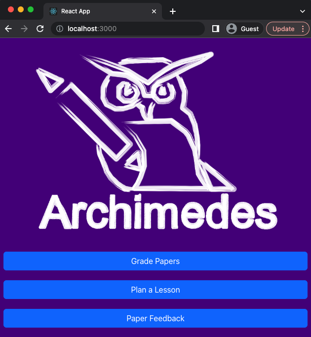

# archimedes
Archimedes is a ChatGPT enabled app that gives teachers the ability to grade papers, generate lesson plans, and get feedback on papers. 

# Running
This is a React App and A Python Flask backend. You will need to ensure you have the right environment for React and Python development as well as the libraries needed. 

For the React App we use 
Formik
react-bootstrap 

For the Python App we use
openai = "*"
python-dotenv = "*"
pypdf = "*"
python-docx = "*"

You will additionally need to define your OpenAI API Keys as environment variables:

OPENAI_API_KEY
OPENAI_ORG

This example leverages GPT-4 and requires the API account above has access to GPT-4. 